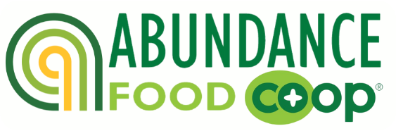

<h1>Special Orders - Abundance Food Co-op, Rochester NY</h1>



### Introduction
This Django application is designed specifically for Abundance Food Co-op in Rochester, NY. Its primary objective is to offer a user-friendly interface tailored for Front-end employees, Buyers, and Managers, facilitating the recording, tracking, and updating of special order statuses. These special orders constitute bulk purchases directly initiated by customers through Abundance, routed to distributors.

Historically, managing special orders has posed challenges in terms of training and operational efficiency, with the organization relying on an Access database for an extended period. While the database includes user experience (UX) enhancements, it lacks comprehensive functionalities and safeguards against inadvertent data loss.

The purpose of this application is to significantly enhance this process, optimizing workflow efficiency. Notably, it will simplify the training of new employees and reduce onboarding time. Additionally, the application will implement measures to prevent unintended actions and provide a safety mechanism against data deletions.

Furthermore, the application will be accessible exclusively within the local network, ensuring secure access via username and password authentication.

### Libraries and Dependencies
This project leverages the Django framework as its foundation, integrating essential libraries and packages to enhance functionality and user experience. 

Key dependencies include Bootstrap 5, Bootstrap Datepicker Plus, and Font Awesome, contributing to a visually appealing and intuitive user interface. 

Additionally, the implementation of Django Select2 and Django Filters ensures an improved user experience through enhanced search and filtering capabilities.

### Project Architecture
The project is structured around three core apps: Orders, Customers, and Vendors. Adhering to the Model-View-Controller (MVC) pattern and Django's conventions, each app comprises distinct components:

- models.py: Defines the database schema, including tables and fields.
- views.py: Manages Create, Read, Update, and Delete (CRUD) operations for data manipulation.
- urls.py: Directs user requests to appropriate views based on URL patterns.
- Templates folder: Contains HTML templates for designing the user interface, following a modular approach.

Additionally, the inclusion of forms.py and filter.py files within each app encapsulates utility classes for model definition and query optimization, respectively.

### Setting Up the Development Environment

1. Begin by cloning the repository onto your local machine.

2. Next, create a new virtual environment and install the necessary dependencies by executing the following commands in your terminal:
  ```bash
  pip install --upgrade pip
  pip install -r requirements.txt
  ```

3.Once the dependencies are installed, run the npm package.json script using:
  ```bash
  npm run dev
  ```
  This script executes the 'dev' script defined in package.json, initiating the webpack build in watch mode. This build process continuously monitors changes in the JavaScript code and automatically recompiles it accordingly.

4. With the webpack build running, start the Django project by entering the command:
  ```bash
  python3 manage.py runserver
  ```
  This command launches the Django development server, integrating the updated JavaScript code into the project.
